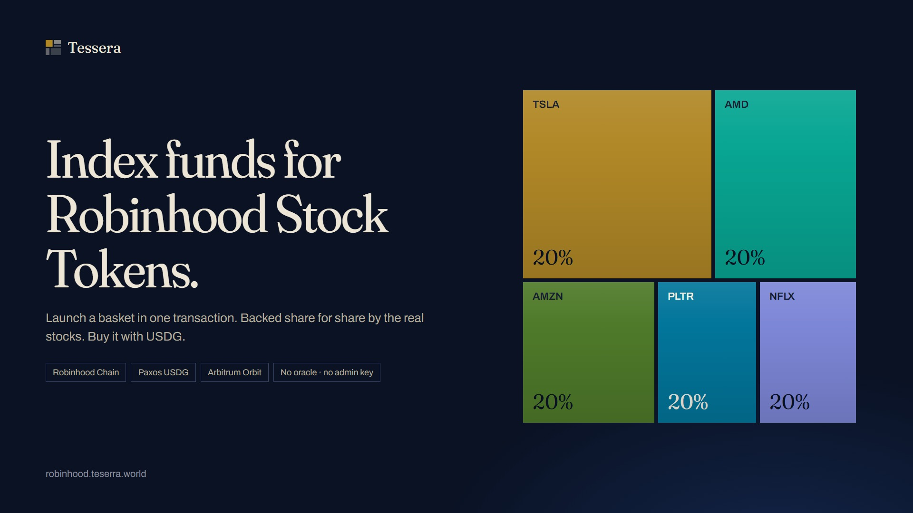
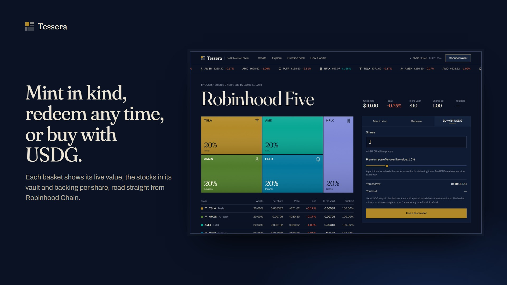
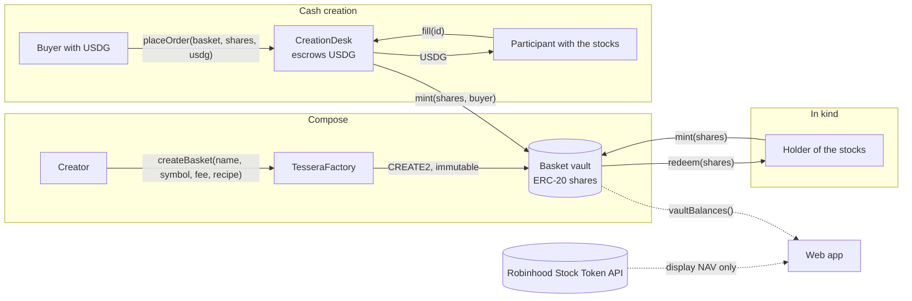
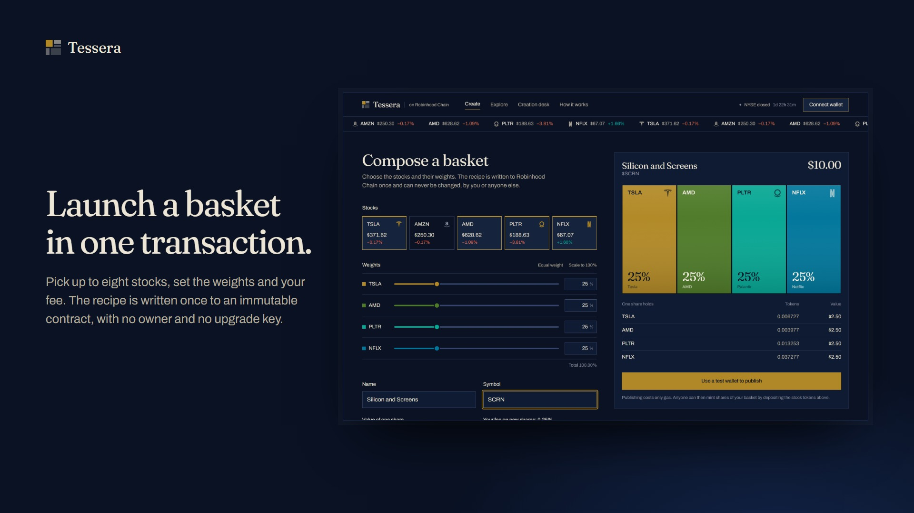

<p align="center">
  
</p>

<h1 align="center">Tessera on Robinhood Chain</h1>

<p align="center">
  <b>Index baskets of Robinhood Stock Tokens. Compose one in a transaction, mint and redeem it in kind, or buy it with USDG.</b>
</p>

<p align="center">
  <a href="https://robinhood.teserra.world"></a>
  <a href="https://explorer.testnet.chain.robinhood.com/address/0xaeF91E3De7a4b96063EB6Fe89890dc8339aB7676#code"></a>
  <a href="https://github.com/RohanGlitched/tessera-robinhood/actions/workflows/test.yml"></a>
  
  
  
</p>

<p align="center">
  <a href="https://robinhood.teserra.world">Live app</a> ·
  <a href="#try-it-in-one-minute">Try it in one minute</a> ·
  <a href="#what-is-on-chain">Contracts</a> ·
  <a href="#guarantees-and-the-tests-that-prove-them">Guarantees</a> ·
  <a href="contracts/SECURITY.md">Security</a> ·
  <a href="#built-during-the-arbitrum-open-house-buildathon">Built during the buildathon</a>
</p>

---

An index fund is a list of companies and a set of weights. Tessera lets anyone publish one on Robinhood Chain.

Pick up to eight **Robinhood Stock Tokens**, set the weights, and launch them as a single ERC-20. Every share is backed by the real stock tokens in a vault anyone can read, and can be redeemed for them at any time. People who hold no stock tokens buy a basket with **Paxos USDG** on an open creation desk, where whoever holds the stocks fills the order, the way an ETF's authorised participants work.

No oracle. No admin key. No pause, upgrade or setter. Redeemable at 3 a.m. on a Sunday.

## Try it in one minute

You do not need a wallet, an extension or any tokens.

1. Open **[robinhood.teserra.world](https://robinhood.teserra.world)** and press **Try it in one minute**.
2. A throwaway key is made in your browser and the project faucet sends it test ETH, a little of each stock token and some USDG (about 30 seconds).
3. You land on the **Robinhood Five** basket. Mint a share in kind, then **Buy with USDG** and watch the house participant deliver the stocks and fill your order within seconds, then redeem.

Every number on the page is real: live Robinhood quotes, the vault's balances read from chain, and transaction links to the Robinhood Chain explorer.

Have MetaMask or Rabby? **Connect wallet → Browser wallet** adds Robinhood Chain testnet for you.

<p align="center">
  
</p>

## Why this exists

- **Robinhood Stock Tokens are single names.** Investors think in themes and indexes: "AI compute", "streaming", "the Robinhood five". Today you buy and rebalance each token yourself.
- **Most basket products ask you to trust someone.** They price creations with an oracle, run on an admin key, or both. Tessera has neither: shares are created and redeemed *in kind*, so the contract never needs a price and there is nothing to administer.
- **Cash is how people actually buy.** The creation desk turns USDG into basket shares without the vault ever touching cash, so the in-kind guarantees hold for everyone.

## How a share is made



Two ways in, one vault. The basket contract never reads a price; quotes are used only to *display* NAV and to size a new recipe at $10 a share.

## What is on chain

Three small Solidity contracts in [`contracts/contracts`](contracts/contracts), deployed and verified on **Robinhood Chain testnet** (chain id 46630, an Arbitrum Orbit chain).

| Contract | Address | What it does |
|---|---|---|
| `TesseraFactory` | [`0xaeF9…7676`](https://explorer.testnet.chain.robinhood.com/address/0xaeF91E3De7a4b96063EB6Fe89890dc8339aB7676#code) | Validates a recipe once (1–8 distinct tokens, weights summing to exactly 100%, creator fee ≤ 1%, name and symbol limits) and deploys an immutable `Basket` at a deterministic CREATE2 address. |
| `Basket` | one per basket, e.g. [HOOD5](https://explorer.testnet.chain.robinhood.com/address/0x41F51f70CA5A5AbC09E2670f31540642a780b55d#code) | The share token and its vault. `mint(shares, to)` pulls the recipe in kind, rounding up; `redeem(shares, to)` burns first, then pays out pro rata, rounding down. No owner, no pause, no upgrade, no setter. |
| `CreationDesk` | [`0x9325…94fA`](https://explorer.testnet.chain.robinhood.com/address/0x932550712d105590c3da4bCBF036dAc4e45394fA#code) | USDG cash creations. A buyer escrows USDG for N shares; anyone fills by delivering the stock tokens; the basket mints straight to the buyer and the filler collects the USDG. The buyer can cancel any time; anyone can return expired escrow. |

Seed baskets, sized at $10 a share from live Robinhood quotes on deploy:

| Basket | Symbol | Holdings | Address |
|---|---|---|---|
| Robinhood Five | `HOOD5` | TSLA · AMZN · AMD · PLTR · NFLX, equal weight | [`0x41F5…b55d`](https://explorer.testnet.chain.robinhood.com/address/0x41F51f70CA5A5AbC09E2670f31540642a780b55d) |
| Compute Rush | `CHIPS` | AMD · PLTR · TSLA | [`0x2099…b090`](https://explorer.testnet.chain.robinhood.com/address/0x2099BD68d14e45624E6eB5Bdf4e0f30350Feb090) |
| Prime Time | `PRIME` | AMZN · NFLX | [`0xbd7d…0a5A`](https://explorer.testnet.chain.robinhood.com/address/0xbd7dA0a7c87f28816656e3a9D073C0bC61870a5A) |

All addresses live in [`contracts/deployments/robinhoodTestnet.json`](contracts/deployments/robinhoodTestnet.json) and are read by the app from [`web/lib/deployment.json`](web/lib/deployment.json).

## Guarantees, and the tests that prove them

| Guarantee | How it is enforced | Proved by |
|---|---|---|
| **Never under-collateralised** | Deposits round up (`Math.Rounding.Ceil`), withdrawals round down; dust stays in the vault. | Seeded random mint/redeem sequences across many accounts assert `vault[i] ≥ previewRedeem(totalSupply)[i]` after every step. |
| **No oracle risk** | Neither `mint` nor `redeem` reads a price. | Static: no price input exists in the ABI. |
| **Fee-on-transfer tokens are refused** | The vault measures what it received and reverts with `ShortDeposit(token, expected, received)`. | A skimming mock token. |
| **Reentrancy** | `nonReentrant` on every state-changing entry point of `Basket` and `CreationDesk`. | A hostile token that re-enters `mint`/`redeem` during transfer is rejected with `ReentrancyGuardReentrantCall`. |
| **Creator fees never touch the vault** | Fees are paid as newly minted shares. | Backing per share is asserted identical before and after fee-bearing mints. |
| **Immutable recipe** | No setters; the recipe is written in the constructor. | ABI enumeration: the only non-view functions on a basket are ERC-20 transfers, `mint` and `redeem`; on the desk `placeOrder`, `fill`, `cancel`. |
| **Deterministic addresses** | `CREATE2` with `keccak256(creator, symbol)`. | The address is predicted off-chain and matched; `SymbolTaken` stops a creator shadowing their own basket. |
| **Desk lifecycle** | Open → Filled or Cancelled, once. | Fill after expiry, double fill, third-party cancel before expiry, expired-escrow return by anyone, exact USDG and share flows, event arguments. |
| **Corporate actions pass through** | Robinhood Stock Tokens express splits and dividends through a multiplier, not by moving raw balances, so a raw-unit recipe is unaffected. | Design property, documented in `Basket.sol`. |

**94 tests, 100% statement, branch, function and line coverage on all three contracts** (`npx hardhat coverage`). The suite includes seeded random walks of 150–250 mint/redeem/transfer/donation steps that end in a full bank run, hostile mock tokens (fee-on-transfer, reentrant, pausable and blocklisting), exact event arguments, an opcode scan of the deployed bytecode for `DELEGATECALL`/`SELFDESTRUCT`, and gas ceilings.

| Operation | Gas |
|---|---|
| `createBasket` (3 components) | 1,501,440 |
| `mint` (warm vault) | 146,688 |
| `redeem` | 109,142 |
| `placeOrder` | 201,123 |
| `fill` (3 components) | 299,752 |

At Robinhood Chain's 0.01 gwei, a first mint costs about $0.000005 of gas.

Run the suite:

```bash
cd contracts && npm install --legacy-peer-deps
npm test                                   # unit, property and security tests on Hardhat
FORK=1 npx hardhat run scripts/fork-e2e.js # every flow against forked Robinhood testnet tokens and USDG
REPORT_GAS=1 npm test                      # gas report
```

The threat model, trust boundaries and known limitations are in [`contracts/SECURITY.md`](contracts/SECURITY.md).

## Robinhood Chain, Arbitrum and USDG

- **Robinhood Stock Tokens** on testnet: TSLA, AMZN, AMD, PLTR, NFLX ([`web/lib/tokens.ts`](web/lib/tokens.ts)).
- **Paxos USDG** (testnet `0x7E95…802F`, 6 decimals) settles every creation-desk order.
- **Robinhood Stock Token API** (`api.robinhood.com/rhj/prices`) drives live NAV, the ticker tape and the market mosaic, proxied and cached for 15 seconds by [`web/app/api/prices`](web/app/api/prices/route.ts).
- **Arbitrum Orbit:** 0.01 gwei gas and sub-second blocks make in-kind creation practical at retail size. A judge's whole walkthrough costs a fraction of a cent of test ETH.
- **Multicall3** keeps every page to one RPC round trip.
- **House participant:** a server route ([`web/app/api/participant`](web/app/api/participant/route.ts)) plays the authorised participant on testnet. It prices every open order against live Robinhood quotes and fills those that pay at least fair value, earning the premium and recycling USDG back into the faucet. It has no special rights on chain; anyone holding the stocks can beat it to a fill.

<p align="center">
  
</p>

## The app

Next.js 15, React 19, viem, Tailwind CSS 4. Design grounded in the subject: a Byzantine-mosaic lapis ground, limestone-ivory type, and a treemap of the basket that doubles as its logo.

| Page | What you can do |
|---|---|
| `/` | Live market mosaic of the five stocks, baskets valued at live quotes, how a share is made, the NYSE clock against the always-on chain. |
| `/compose` | Pick stocks, drag weights, name it, set a creator fee, publish. Recipe sized from live prices to a share value you choose. |
| `/explore` | Every basket the factory has ever published, nothing listed or approved. |
| `/basket/[address]` | NAV and 24h move, vault holdings and backing per stock, mint in kind, redeem, buy with USDG, the basket's creation-desk orders. |
| `/desk` | Every open order. Fill one with your stocks and keep the premium, or cancel your own. |
| `/method` | The rules in plain words, with contract links. |

Every state is designed: skeletons the size of the content, empty states that say what to do next, contract reverts mapped to one plain sentence each, buttons that lock while a transaction is in flight, and a transaction link on every success. Tested at 1440px and 390px with no sideways scroll.

## Repository

```
contracts/            Hardhat project
  contracts/          Basket.sol, TesseraFactory.sol, CreationDesk.sol (+ mocks for tests)
  test/               unit, property, security, lifecycle, event and gas tests
  scripts/            deploy.js, verify.js, fork-e2e.js (rehearsal on forked testnet tokens)
  SECURITY.md         threat model and attack table
web/                  Next.js app
  app/                pages and API routes (prices proxy, faucet, participant, OG image)
  components/         mosaic, market clock, ticker tape, wallet, basket actions, orders table
  lib/                chain config, ABIs, basket hooks, palette, formatting
docs/                 images used in this README
```

### Run the app locally

```bash
cd web && npm install
npm run dev            # http://localhost:3000, reads web/lib/deployment.json
```

Optional, to enable **Get test tokens** and the house participant: `FAUCET_PRIVATE_KEY=0x…` (a testnet-only key holding test ETH, stock tokens and USDG) in `web/.env.local`.

### Deploy your own

```bash
cd contracts
echo "DEPLOYER_PRIVATE_KEY=0x…" > .env               # testnet only
npx hardhat run scripts/deploy.js --network robinhoodTestnet
npx hardhat run scripts/verify.js --network robinhoodTestnet
```

`deploy.js` deploys the factory and desk, publishes the three seed baskets sized at $10 a share from live quotes, and writes the addresses to `web/lib/deployment.json`.

## Built during the Arbitrum Open House buildathon

Tessera began as a Solana project (an Anchor program for xStocks baskets). Everything in this repository was written for Robinhood Chain during the buildathon:

- The three Solidity contracts, from scratch. The USDG creation desk did not exist before.
- The test suite: factory validation, rounding invariants under random sequences, hostile tokens, desk lifecycle, event arguments, immutability by ABI, gas snapshots, plus a fork rehearsal against the real testnet stock tokens and USDG.
- The EVM web app: composer, explorer, basket page, creation desk, method page, in-browser test wallet, faucet, one-click quick start and the house participant.
- Deployment and verification on Robinhood Chain testnet with three seed baskets.

The visual design system (palette, type, mosaic) is carried over from the Solana app.

## What comes next

- **Rebalancing baskets** as a second contract type: a recipe that migrates in kind through the desk, so holders never touch cash.
- **Arbitrum One and Robinhood Chain mainnet** once Robinhood Stock Tokens and USDG are live there; the contracts are chain-agnostic.
- **Permissionless participants**: a public bot template so market makers can compete for desk premiums.
- **Baskets of baskets**: a basket is an ERC-20, so a fund of funds needs no new code.

## Team

**Rohan Borade** · [GitHub](https://github.com/RohanGlitched)

## License

MIT
